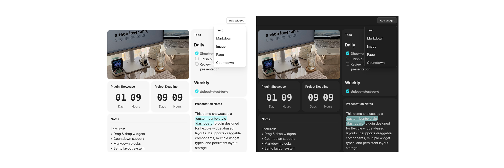
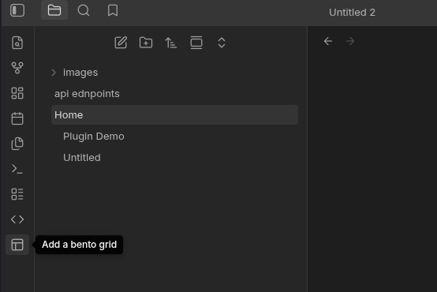

# Bento Grid

[Obsidian](https://obsidian.md) plugin that creates a customizable bento-style grid inside a pane. Widgets can contain rendered markdown, images, pages, countdowns, and other content types. Items can be dragged, resized, and arranged to create personalized dashboards.

## Features

* Drag & drop widgets
* Resize widgets using drag handles
* Render markdown inside widgets
* Support for multiple widget types:
  * Markdown
  * Images
  * Pages
  * Countdowns
* Flexible bento-style layouts
* Transparent and standard widget modes

## Getting Started

1. Search for `Bento Grid` in Community Plugins.
2. Install and enable the plugin in Obsidian.
3. Open any note where you want to create a bento grid.
4. Click the **pane layout** button in the sidebar to open a Bento Grid pane.
5. Add widgets using the **Add Widget** button and customize your layout however you like.

## Notes / TODO

- Improve markdown rendering, fix rendering problem
- Add additional widget types
- Improve mobile responsiveness

 

> The plugin needs getMarkdownFiles() to locate notes containing frontmatter metadata before reading selected files.

If you find this plugin useful, consider supporting me:

